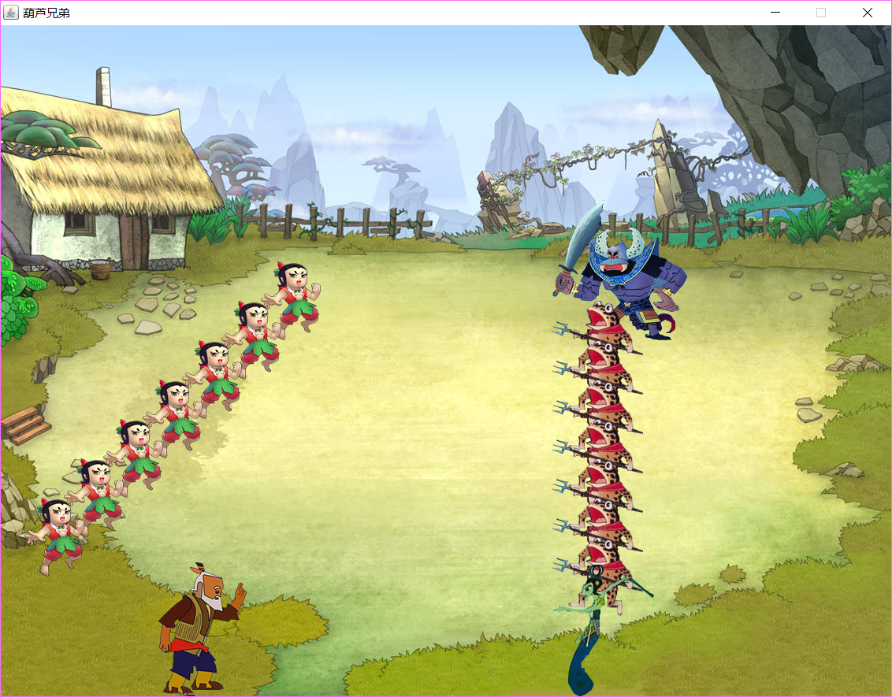
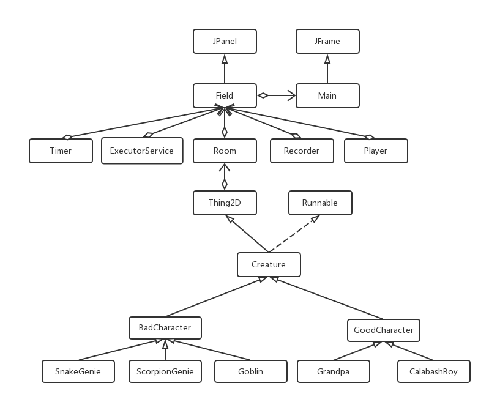
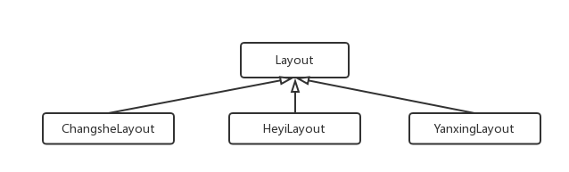

# 葫芦娃小游戏

[TOC]

## 游戏说明

游戏加载完成后，按空格键开始游戏，之后可以通过空格键控制开始/暂停。

初始状态下，葫芦娃一方按照雁行布阵，蝎子精一方按照长蛇布阵。葫芦娃一方会自动寻找离自己最近的敌人去攻击，反派则随机移动。当双方相遇时会自动展开攻击，其中一个会在攻击一段时间之后死亡。葫芦娃一方死亡后会变为一个紫色的葫芦，反派死亡之后会变为一个彩色的冰晶。一方全部死亡之后游戏结束。

在游戏尚未开始或暂停状态下，可以按L键加载以前的记录，对以前的记录进行回放，回放过程中将屏蔽键盘信号（记录文件扩展名为.rcd）。




## 游戏架构

类之间的主体骨架如下图



下面将自顶向下介绍。

### Main类

Main类为程序的入口，继承自JFrame，作为最外层窗口，装载并启动Field。

### Field类

Field类为UI程序的核心类，继承自JPanel类，用于管理各生物的线程、刷新屏幕、记录与重放。下面介绍聚合在其中的各class的功能。

- **Timer类**：计时，每隔一定时间调用repaint函数对屏幕进行一次刷新
- **ExectorService类**：管理各个线程，开始时启动各线程，暂停时结束各线程
- **Room类**：保存二维空间中的信息，包括所有生物和其他二维物体
- **Recorder类**：在每次repaint时记录当前Room状态（即二维空间中的信息），并写入记录文件
- **Player类** ：读取记录文件并播放，因为Player需要控制Field类，所以Player作为内部类实现

### Thing2D类

Thing2D类表示二维空间的一个物体，具有图像、位置的属性。

### Creature类

Creature类表示一个生物，并实现了Runnable接口。

Creature类有三种状态：RUNNING，FIGHTING，DEAD。在run方法中通过判断当前状态执行相应的方法，三种状态如下：

* **RUNNING** ：根据当前棋盘走动，若碰到了敌人，则进入FIGHTING状态
* **FIGHTING** ：攻击敌人，随机决定生死
* **DEAD** ：死亡，显示死亡的状态

### Character相关类

Character相关类表示的是这属于正派还是反派，GoodCharacter和BadCharacter分别表示正派和反派。行为的不同点在于：

* 正派会主动寻找目标进行攻击，反派会随机移动
* 正派死亡后会显示为一个紫色的葫芦，反派死亡之后会显示为一个彩色的冰晶

### Position类

Position类用于保存Thing2D的位置，同时会记录当前Position上的Thing2D。

### Queue类

Queue类保存一个生物的阵型，可以使用Layout对其进行排序，排序完成之后将这个队形加入到二维空间中，使得阵型中的所有生物都可以在二维空间中需要的阵型。

### Layout相关类

Layout相关类负责对Creature的阵型进行排序，UML图如下



初始化二维空间的时候，会使用Layout对初始的Creature队列进行排序，让每一个生物拥有一个队列中的相对位置，然后再把队列加入到二维空间的绝对位置处。

## 设计思路

### 面向对象设计

#### 封装

把位置信息封装在Position类中，可以通过set，get方法来设置与访问，这样无论坐标变为一维，二维还是三维，都只需要在Position类中修改。

#### 继承

通过Thing2D类->Creature类->Character类->具体生物类的继承链，把很多共同的方法都放在父类，不同的方法放在子类，使得代码冗余较少，便于修改。如Thing2D负责管理物体的图像和位置信息，Creature负责管理线程的运行，并向子类提供一些共有的服务方法，Character相关类负责寻路方法，具体类就可以只负责较少的个性化方法。

#### 多态

在Creature类中有一些抽象函数，供子类实现以得到不同的实现效果。如

```java
public abstract void setStatus(Status status); //设置当前状态
public abstract void setDefaultImageIcon(); //将本Creature图像重置为默认图像
```

因为不同子类的默认图像不同，设置状态方式也不同，所以Creature类中设计了这两个抽象方法供子类实现。setStatus()和setDefaultImageIcon()均在Character相关类中得到了实现。

### 设计原则

#### SRP：单一职责原则

类关系架构中，一个类承担尽可能少的职责。如Room类只负责保存空间信息，与图形界面完全隔离；Thing2D类只负责保存位置和图像信息。

#### OCP：开放封闭原则

在基类中设计了一些抽象方法，以达到对扩展开放的效果，而对于那些不需要更改但需要子类访问的方法（如判断是否会和另一个Creature位置冲突），则标记为protected final方法，对于子类无需知道的内部实现，则标记为private方法。

#### LSP：Liskov替换法则

在子类继承父类时，均为实现接口或抽象函数，没有对基类已实现方法的重写。

#### ISP：接口隔离原则

类之间的依赖关系最典型的就是Room与Creature之间的依赖，Room与各具体生物之间的交互都是通过抽象类Creature来完成的。

### 设计模式

#### 模板方法

在Creature的run函数中使用了这一模式，由Creature实现run函数的框架，并提供3个抽象方法供子类实现，如下

```java
protected abstract void move(); //移动
protected abstract void fight(); //攻击
protected abstract void dead(); //死亡
public final void run(){
  try{
    while(true){
      synchronized (room) {
        switch (status){
          case RUNNING: move(); break;
          case FIGHTING: fight(); break;
          case DEAD: dead(); break;
          default: ;
        }
      }
      TimeUnit.MILLISECONDS.sleep(100);
    }
  }catch (Exception e){
    System.out.println(this+"被中断，状态:"+this.status);
  }
}
```

一个生物有移动、攻击、死亡三种状态，所以一个具体生物类需要实现这三种状态下生物所要做的动作，在具体实现时直接由run函数调用即可。这样不仅可以减少代码冗余，而且基类可以替子类解决互斥访问的问题。

#### 组合模式

将所有生物加入到二维空间的类中，由二维空间进行统一管理。

#### 默认适配器模式与观察者模式

通过内部类实现继承自KayAdapter的KAdapter，以实现对键盘的监听。

### 其他Java机制

* 在Room类中使用了Collection的ArrayList
* 在线程sleep、IO等中用到了try-catch机制
* 为了防止并发访问出错，在适当的地方加了synchronized关键字以实现多线程互斥访问临界区
* 在重载、测试等位置添加了合适的注解
* 游戏记录与读取使用了文件IO

## 单元测试

由于本程序为多线程运行及图形化界面，所以多线程与图形化相关的模块难以进行单元测试。因为可测试的模块多数实现非常简单，没有必要测试，这里只对少量可能出错的功能函数进行了单元测试，如检查本Creature是否会与二维空间中的其他Creature相撞，本Creature是否会和指定Creature相撞等。

## 精彩回放

在数次测试中，选择了一次比较精彩的战斗，这次双方都死伤惨重，最终以反方微弱优势胜利，保存为工程根目录下的"goodgame.rcd"文件，读取之后便可以回放。